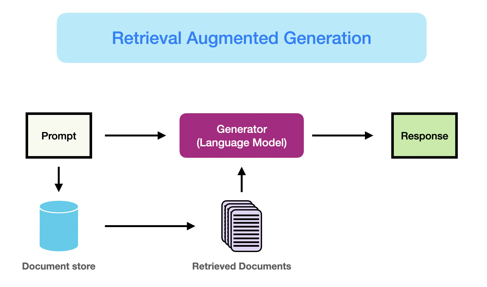

# Генерация с использованием поиска (RAG) для больших языковых моделей

Работа с большими языковыми моделями (LLM) сопряжена с рядом проблем, таких как пробелы в знаниях, вопросы фактичности и галлюцинации. Генерация с использованием поиска (RAG) предлагает решение для смягчения некоторых из этих проблем, дополняя LLM внешними источниками знаний, такими как базы данных. RAG особенно полезен в сценариях, требующих интенсивных знаний или в приложениях, где информация постоянно обновляется. Ключевым преимуществом RAG является то, что LLM не нужно переобучать для конкретных задач. RAG стал популярным благодаря своему применению в разговорных агентах.

В этом обзоре мы выделяем основные выводы и практические инсайты из недавнего исследования под названием [Retrieval-Augmented Generation for Large Language Models: A Survey](https://arxiv.org/abs/2312.10997) (Gao et al., 2023). В частности, мы сосредоточимся на существующих подходах, передовых методах RAG, оценке, приложениях и технологиях, окружающих различные компоненты системы RAG (поиск, генерация и методы дополнения).

## Введение в RAG

Как лучше всего объяснено [здесь](https://www.promptingguide.ai/techniques/rag), RAG можно определить следующим образом:

> RAG принимает входные данные и извлекает набор релевантных/поддерживающих документов из источника (например, Википедии). Документы объединяются в качестве контекста с исходным промптом и передаются генератору текста, который создает окончательный вывод. Это делает RAG адаптивным для ситуаций, когда факты могут изменяться со временем. Это очень полезно, так как параметрические знания LLM статичны. RAG позволяет языковым моделям обходить необходимость переобучения, обеспечивая доступ к последней информации для генерации надежных выводов через генерацию на основе поиска.

Вкратце, извлеченные доказательства, полученные в RAG, могут служить способом повышения точности, управляемости и релевантности ответа LLM. Это помогает уменьшить проблемы галлюцинаций или производительности при решении задач в быстро меняющейся среде.

Хотя RAG также включал оптимизацию методов предобучения, текущие подходы в значительной степени перешли к сочетанию сильных сторон RAG и мощных дообученных моделей, таких как Yandex GPT. На диаграмме ниже показана эволюция исследований, связанных с RAG:

*[Источник рисунка](https://arxiv.org/abs/2312.10997)*

Ниже приведен типичный рабочий процесс приложения RAG:

*[Источник рисунка](https://arxiv.org/abs/2312.10997)*

Мы можем объяснить различные шаги/компоненты следующим образом:
- **Входные данные:** Вопрос, на который система LLM отвечает, называется входными данными. Если RAG не используется, LLM напрямую отвечает на вопрос.
- **Индексация:** Если используется RAG, то серия связанных документов индексируется путем их разбиения на части, создания эмбеддингов этих частей и индексации их в векторном хранилище. При выводе запрос также преобразуется в эмбеддинг аналогичным образом.
- **Поиск:** Релевантные документы извлекаются путем сравнения запроса с индексированными векторами, также называемыми "релевантными документами".
- **Генерация:** Релевантные документы объединяются с исходным промптом в качестве дополнительного контекста. Объединенный текст и промпт затем передаются модели для генерации ответа, который затем подготавливается как окончательный вывод системы для пользователя.

В приведенном примере использование модели напрямую не позволяет ответить на вопрос из-за отсутствия знаний о текущих событиях. С другой стороны, при использовании RAG система может получить релевантную информацию, необходимую для правильного ответа на вопрос.

## Парадигмы RAG

За последние несколько лет системы RAG эволюционировали от наивного RAG до продвинутого RAG и модульного RAG. Эта эволюция произошла для решения определенных ограничений, связанных с производительностью, стоимостью и эффективностью.

*[Источник рисунка](https://arxiv.org/abs/2312.10997)*

### Наивный RAG
Наивный RAG следует традиционному процессу индексации, поиска и генерации. Вкратце, пользовательский ввод используется для запроса релевантных документов, которые затем объединяются с промптом и передаются модели для генерации окончательного ответа. История диалога может быть интегрирована в промпт, если приложение включает многократные диалоговые взаимодействия.

Наивный RAG имеет ограничения, такие как низкая точность (несоответствие извлеченных частей) и низкая полнота (неспособность извлечь все релевантные части). Также возможно, что LLM передается устаревшая информация, что является одной из основных проблем, которые система RAG должна изначально решать. Это приводит к проблемам галлюцинаций и плохим и неточным ответам.

Когда применяется дополнение, могут возникнуть проблемы с избыточностью и повторением. При использовании нескольких извлеченных фрагментов также важны ранжирование и согласование стиля/тона. Еще одна проблема заключается в том, чтобы генерация не слишком зависела от дополненной информации, что может привести к тому, что модель просто повторяет извлеченное содержание.

### Продвинутый RAG

Продвинутый RAG помогает решать проблемы, присутствующие в наивном RAG, такие как улучшение качества поиска, которое может включать оптимизацию процессов до поиска, поиска и после поиска.

Процесс до поиска включает оптимизацию индексации данных, которая направлена на повышение качества индексируемых данных через пять этапов: повышение гранулярности данных, оптимизация структур индекса, добавление метаданных, оптимизация выравнивания и смешанный поиск.

Этап поиска можно дополнительно улучшить, оптимизируя саму модель эмбеддинга, что напрямую влияет на качество частей, составляющих контекст. Это можно сделать путем дообучения эмбеддинга для оптимизации релевантности поиска или использования динамических эмбеддингов, которые лучше улавливают контекстное понимание (например, модель embeddings-ada-02 от OpenAI).

Оптимизация после поиска фокусируется на избегании ограничений окна контекста и работе с шумной или потенциально отвлекающей информацией. Общий подход к решению этих проблем — повторное ранжирование, которое может включать такие подходы, как перемещение релевантного контекста к краям промпта или пересчет семантического сходства между запросом и релевантными текстовыми фрагментами. Сжатие промпта также может помочь в решении этих проблем.

### Модульный RAG

Как следует из названия, модульный RAG улучшает функциональные модули, такие как включение модуля поиска для поиска по сходству и применение дообучения в поисковике. И наивный RAG, и продвинутый RAG являются частными случаями модульного RAG и состоят из фиксированных модулей. Расширенные модули RAG включают поиск, память, слияние, маршрутизацию, предсказание и адаптер задач, которые решают различные проблемы. Эти модули можно перестраивать в соответствии с конкретными задачами. Таким образом, модульный RAG выигрывает от большей разнообразности и гибкости, так как вы можете добавлять или заменять модули или настраивать поток между модулями в зависимости от требований задачи.

С учетом увеличенной гибкости в построении систем RAG, были предложены другие важные методы оптимизации для оптимизации конвейеров RAG, включая:

- **Гибридное исследование поиска:** Этот подход использует комбинацию методов поиска, таких как поиск по ключевым словам и семантический поиск, для извлечения релевантной и контекстно богатой информации; это полезно при работе с различными типами запросов и информационными потребностями.
- **Рекурсивный поиск и движок запросов:** Включает рекурсивный процесс поиска, который может начинаться с небольших семантических фрагментов и последовательно извлекать более крупные фрагменты, обогащающие контекст; это полезно для балансировки эффективности и контекстно богатой информации.
- **StepBack-промпт:** [Техника промптинга](https://arxiv.org/abs/2310.06117), которая позволяет LLM выполнять абстракцию, создавая концепции и принципы, которые направляют рассуждения; это приводит к более обоснованным ответам при использовании в рамках RAG, так как LLM отходит от конкретных примеров и может рассуждать более широко, если это необходимо.
- **Подзапросы:** Существуют различные стратегии запросов, такие как древовидные запросы или последовательный запрос фрагментов, которые можно использовать для различных сценариев. LlamaIndex предлагает [движок подзапросов](https://docs.llamaindex.ai/en/latest/understanding/putting_it_all_together/agents.html#), который позволяет разбить запрос на несколько вопросов, использующих различные релевантные источники данных.
- **Гипотетические эмбеддинги документов:** [HyDE](https://arxiv.org/abs/2212.10496) генерирует гипотетический ответ на запрос, создает его эмбеддинг и использует его для поиска документов, похожих на гипотетический ответ, вместо использования самого запроса.

## Архитектура RAG

В этом разделе мы обобщаем ключевые разработки компонентов системы RAG, которые включают поиск, генерацию и дополнение.

### Поиск

Поиск — это компонент RAG, который занимается извлечением высоко релевантного контекста из поисковика. Поисковик можно улучшить различными способами, включая:

**Улучшение семантических представлений**

Этот процесс включает прямое улучшение семантических представлений, которые питают поисковик. Вот несколько соображений:

- **Разбиение на части:** Один из важных шагов — выбор правильной стратегии разбиения, которая зависит от содержания, с которым вы работаете, и приложения, для которого вы генерируете ответы. Разные модели также демонстрируют разные сильные стороны на различных размерах блоков. Трансформеры предложений будут лучше работать с отдельными предложениями, но text-embedding-ada-002 будет лучше работать с блоками, содержащими 256 или 512 токенов. Другие аспекты, которые следует учитывать, включают длину пользовательских вопросов, приложение и ограничения по токенам, но обычно экспериментируют с различными стратегиями разбиения, чтобы помочь оптимизировать поиск в вашей системе RAG.
- **Дообученные модели эмбеддингов:** После того как вы определили эффективную стратегию разбиения, может потребоваться дообучение модели эмбеддингов, если вы работаете с специализированной областью. В противном случае возможно, что пользовательские запросы будут полностью неправильно поняты в вашем приложении. Вы можете дообучить на широких знаниях области (т.е. дообучение знаний области) и для конкретных задач. [BGE-large-EN, разработанная BAAI](https://github.com/FlagOpen/FlagEmbedding), является заметной моделью эмбеддингов, которую можно дообучить для оптимизации релевантности поиска.

**Выравнивание запросов и документов**

Этот процесс занимается выравниванием пользовательских запросов с документами в семантическом пространстве. Это может потребоваться, когда пользовательский запрос может не содержать семантической информации или содержать неточные формулировки. Вот некоторые подходы:

- **Переписывание запросов:** Фокусируется на переписывании запросов с использованием различных техник, таких как [Query2Doc](https://arxiv.org/abs/2303.07678), [ITER-RETGEN](https://arxiv.org/abs/2305.15294) и HyDE.
- **Трансформация эмбеддингов:** Оптимизирует представление эмбеддингов запросов и выравнивает их с латентным пространством, которое более тесно связано с задачей.

**Выравнивание поисковика и LLM**

Этот процесс занимается выравниванием выходных данных поисковика с предпочтениями LLM.

- **Дообучение поисковиков:** Использует сигналы обратной связи LLM для уточнения моделей поиска. Примеры включают адаптированный к дополнению поисковик ([AAR](https://arxiv.org/abs/2305.17331)), [REPLUG](https://arxiv.org/abs/2301.12652) и [UPRISE](https://arxiv.org/abs/2303.08518), чтобы назвать несколько.
- **Адаптеры:** Включает внешние адаптеры для помощи в процессе выравнивания. Примеры включают [PRCA](https://aclanthology.org/2023.emnlp-main.326/), [RECOMP](https://arxiv.org/abs/2310.04408) и [PKG](https://arxiv.org/abs/2305.04757).

### Генерация

Генератор в системе RAG отвечает за преобразование извлеченной информации в связный текст, который будет формировать окончательный вывод модели. Этот процесс включает разнообразные входные данные, которые иногда требуют усилий для уточнения адаптации языковой модели к входным данным, полученным из запросов и документов. Это можно решить с помощью процесса после поиска и дообучения:

- **Процесс после поиска с замороженной LLM:** Обработка после поиска оставляет LLM нетронутой и вместо этого фокусируется на улучшении качества результатов поиска через операции, такие как сжатие информации и повторное ранжирование результатов. Сжатие информации помогает уменьшить шум, решить проблемы с ограничениями длины контекста LLM и улучшить эффекты генерации. Повторное ранжирование направлено на переупорядочивание документов, чтобы приоритет был отдан наиболее релевантным элементам.
- **Дообучение LLM для RAG:** Для улучшения системы RAG генератор можно дополнительно оптимизировать или дообучить, чтобы гарантировать, что сгенерированный текст является естественным и эффективно использует извлеченные документы.

### Дополнение

Дополнение включает процесс эффективной интеграции контекста из извлеченных фрагментов с текущей задачей генерации. Прежде чем обсуждать больше о процессе дополнения, этапах дополнения и данных дополнения, вот таксономия основных компонентов RAG:

*[Источник рисунка](https://arxiv.org/abs/2312.10997)*

Дополнение поиска можно применять на различных этапах, таких как предобучение, дообучение и вывод.

- **Этапы дополнения:** [RETRO](https://arxiv.org/abs/2112.04426) является примером системы, которая использует дополнение поиска для крупномасштабного предобучения с нуля; она использует дополнительный кодировщик, построенный на основе внешних знаний. Дообучение также можно комбинировать с RAG для разработки и улучшения эффективности систем RAG. На этапе вывода применяются многие техники для эффективного включения извлеченного контента для удовлетворения специфических требований задачи и дальнейшего уточнения процесса RAG.

- **Источник дополнения:** Эффективность модели RAG сильно зависит от выбора источника данных для дополнения. Данные можно классифицировать на неструктурированные, структурированные и сгенерированные LLM данные.

- **Процесс дополнения:** Для многих задач (например, многократного рассуждения) одного поиска недостаточно, поэтому были предложены несколько методов:
    - **Итеративный поиск** позволяет модели выполнять несколько циклов поиска для улучшения глубины и релевантности информации. Известные подходы, использующие этот метод, включают [RETRO](https://arxiv.org/abs/2112.04426) и [GAR-meets-RAG](https://arxiv.org/abs/2310.20158).
    - **Рекурсивный поиск** рекурсивно использует вывод одного этапа поиска в качестве входных данных для другого этапа поиска; это позволяет углубляться в релевантную информацию для сложных и многократных запросов (например, академические исследования и анализ юридических дел). Известные подходы, использующие этот метод, включают [IRCoT](https://arxiv.org/abs/2212.10509) и [Tree of Clarifications](https://arxiv.org/abs/2310.14696).
    - **Адаптивный поиск** настраивает процесс поиска в соответствии с конкретными требованиями, определяя оптимальные моменты и содержание для поиска. Известные подходы, использующие этот метод, включают [FLARE](https://arxiv.org/abs/2305.06983) и [Self-RAG](https://arxiv.org/abs/2310.11511).

На рисунке ниже представлено подробное описание исследований RAG с различными аспектами дополнения, включая этапы дополнения, источник и процесс.

*[Источник рисунка](https://arxiv.org/abs/2312.10997)*

### RAG vs. Дообучение

Существует множество открытых дискуссий о различиях между RAG и дообучением и в каких сценариях каждый из них уместен. Исследования в этих двух областях показывают, что RAG полезен для интеграции новых знаний, в то время как дообучение можно использовать для улучшения производительности и эффективности модели путем улучшения внутренних знаний, формата вывода и обучения сложным инструкциям. Эти подходы не являются взаимоисключающими и могут дополнять друг друга в итеративном процессе, направленном на улучшении производительности модели.

## Оценка RAG

Оценка систем RAG является важным аспектом, так как она помогает понять, насколько эффективно система решает задачи и насколько она улучшает производительность по сравнению с другими подходами. Оценка RAG включает несколько метрик и методов, которые помогают измерить различные аспекты системы, такие как точность поиска, качество генерации и фактичность ответов.

### Метрики оценки

1. **Точность поиска**:
   - **Precision@k**: Процент релевантных документов среди первых \(k\) извлеченных документов.
   - **Recall@k**: Процент всех релевантных документов, которые были извлечены среди первых \(k\) документов.
   - **Mean Reciprocal Rank (MRR)**: Среднее значение обратного ранга первого релевантного документа.

2. **Качество генерации**:
   - **BLEU (Bilingual Evaluation Understudy)**: Метрика, измеряющая точность машинного перевода путем сравнения с эталонными переводами.
   - **ROUGE (Recall-Oriented Understudy for Gisting Evaluation)**: Метрика, измеряющая качество резюмирования текста путем сравнения с эталонными резюме.
   - **METEOR (Metric for Evaluation of Translation with Explicit ORdering)**: Метрика, учитывающая точность, полноту и порядок слов.

3. **Фактичность ответов**:
   - **FactCC**: Метрика, оценивающая фактическую корректность сгенерированных текстов.
   - **FEQA (Fact Extraction and Question Answering)**: Метрика, оценивающая фактическую корректность путем извлечения фактов и проверки их с помощью вопросов и ответов.

### Методы оценки

1. **Автоматическая оценка**: Использование вышеупомянутых метрик для автоматической оценки качества системы. Это позволяет быстро и эффективно измерять производительность системы на больших объемах данных.

2. **Человеческая оценка**: Включает привлечение экспертов или пользователей для оценки качества и фактичности сгенерированных ответов. Это позволяет получить более точную и детализированную оценку, особенно в сложных или неоднозначных случаях.

3. **А/Б тестирование**: Сравнение двух версий системы (например, с использованием RAG и без него) на реальных пользователях для оценки улучшений в производительности и удовлетворенности пользователей.

### Применения RAG

RAG находит применение в различных областях, включая:

1. **Разговорные агенты**: Улучшение качества ответов и уменьшение количества галлюцинаций в чат-ботах и виртуальных помощниках.
2. **Системы вопрос-ответ**: Повышение точности и полноты ответов на вопросы, требующие актуальной информации.
3. **Резюмирование текста**: Создание более точных и информативных резюме больших текстов.
4. **Машинный перевод**: Улучшение качества перевода путем интеграции актуальной информации из внешних источников.
5. **Анализ данных и бизнес-аналитика**: Помощь в извлечении и интерпретации данных из больших объемов информации.

### Заключение

Генерация с использованием поиска (RAG) представляет собой мощный инструмент для улучшения производительности и качества работы больших языковых моделей. Эволюция RAG от наивного к продвинутому и модульному подходам позволяет более гибко настраивать систему в зависимости от конкретных задач. Оценка RAG с использованием различных метрик и методов помогает понять, насколько эффективно система решает задачи и насколько она улучшает производительность по сравнению с другими подходами. Применение RAG в различных областях, таких как разговорные агенты, системы вопрос-ответ, резюмирование текста и машинный перевод, демонстрирует его потенциал для создания более точных и информативных систем.